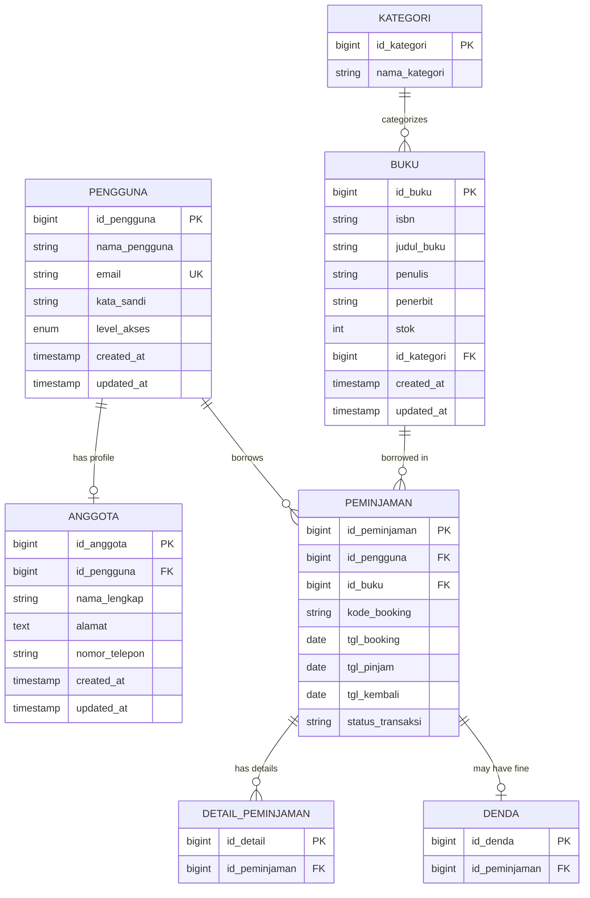

# Laporan Audit - Sistem Perpustakaan Digital

**Tanggal Audit:** 3 Februari 2026  
**Proyek:** Sistem Perpustakaan Digital (Biblio)  
**Lokasi:** `d:\project_ujikom\sistem-perpustakaan-digital`

---

## 📋 Ringkasan Eksekutif

Sistem Perpustakaan Digital adalah aplikasi web berbasis Laravel 12 yang dirancang untuk mengelola perpustakaan digital dengan fitur autentikasi, manajemen buku, peminjaman, dan sistem denda. Aplikasi ini menggunakan teknologi modern dengan desain glassmorphism yang menarik.

### Status Proyek

- ✅ **Framework:** Laravel 12 (PHP 8.2+)
- ✅ **Frontend:** TailwindCSS 4, Blade Templates
- ✅ **Database:** MySQL (dengan SQLite untuk development)
- ✅ **Autentikasi:** Custom authentication system
- ✅ **Password Reset:** Implemented

---

## 🛠️ Teknologi yang Digunakan

### Backend

| Teknologi         | Versi   | Keterangan               |
| ----------------- | ------- | ------------------------ |
| PHP               | ^8.2    | Bahasa pemrograman utama |
| Laravel Framework | ^12.0   | Framework PHP modern     |
| Laravel Tinker    | ^2.10.1 | REPL untuk Laravel       |

### Frontend

| Teknologi             | Versi   | Keterangan    |
| --------------------- | ------- | ------------- |
| TailwindCSS           | ^4.0.0  | CSS framework |
| Vite                  | ^6.0.11 | Build tool    |
| Axios                 | ^1.7.4  | HTTP client   |
| Bootstrap Icons       | 1.11.3  | Icon library  |
| Google Fonts (Outfit) | -       | Typography    |

### Development Tools

| Tool             | Versi   | Keterangan            |
| ---------------- | ------- | --------------------- |
| Laravel Debugbar | ^4.0    | Debugging tool        |
| Laravel Pint     | ^1.13   | Code style fixer      |
| PHPUnit          | ^11.5.3 | Testing framework     |
| Concurrently     | ^9.0.1  | Run multiple commands |

### Database

- **Production:** MySQL (Host: 127.0.0.1, Port: 3306, Database: perpustakaan)
- **Development:** SQLite (database.sqlite)

---

## 🏗️ Arsitektur Proyek

### Struktur Direktori

```
sistem-perpustakaan-digital/
├── app/
│   ├── Http/
│   │   └── Controllers/
│   │       ├── AuthController.php
│   │       ├── Controller.php
│   │       └── PasswordResetController.php
│   ├── Models/
│   │   ├── Anggota.php
│   │   ├── Buku.php
│   │   ├── Denda.php
│   │   ├── DetailPeminjamanan.php
│   │   ├── Kategori.php
│   │   ├── Peminjaman.php
│   │   ├── Pengguna.php
│   │   └── User.php
│   └── Providers/
│       └── AppServiceProvider.php
├── database/
│   ├── migrations/ (10 files)
│   ├── factories/
│   └── seeders/
├── resources/
│   ├── css/
│   │   └── app.css
│   ├── js/
│   │   ├── app.js
│   │   └── bootstrap.js
│   └── views/
│       ├── auth/
│       │   ├── forgot-password.blade.php
│       │   ├── login.blade.php
│       │   ├── register.blade.php
│       │   └── reset-password.blade.php
│       ├── layouts/
│       │   └── auth.blade.php
│       ├── dashboard.blade.php
│       └── welcome.blade.php
├── routes/
│   ├── web.php
│   └── console.php
└── public/
```

---

## 💾 Database Schema

### Tabel dan Relasi

#### 1. **pengguna** (Users Table)

```php
- id_pengguna (PK)
- nama_pengguna (string, 100)
- email (string, unique)
- kata_sandi (hashed string)
- level_akses (enum: 'admin', 'petugas', 'anggota')
- remember_token
- timestamps
```

**Relasi:**

- `hasOne` → Anggota
- `hasMany` → Peminjaman

#### 2. **anggota** (Members Table)

```php
- id_anggota (PK)
- id_pengguna (FK → pengguna)
- nama_lengkap
- alamat
- nomor_telepon
- timestamps
```

**Relasi:**

- `belongsTo` → Pengguna

#### 3. **kategori** (Categories Table)

```php
- id_kategori (PK)
- nama_kategori
- timestamps (optional)
```

**Relasi:**

- `hasMany` → Buku

#### 4. **buku** (Books Table)

```php
- id_buku (PK)
- isbn (string, 20, nullable)
- judul_buku (string, 255)
- penulis (string, 100, nullable)
- penerbit (string, 100, nullable)
- stok (integer)
- id_kategori (FK → kategori, nullable)
- timestamps
```

**Relasi:**

- `belongsTo` → Kategori
- `hasMany` → Peminjaman

#### 5. **peminjaman** (Borrowing Table)

```php
- id_peminjaman (PK)
- id_pengguna (FK → pengguna)
- id_buku (FK → buku)
- kode_booking
- tgl_booking
- tgl_pinjam
- tgl_kembali
- status_transaksi
- timestamps (disabled)
```

**Relasi:**

- `belongsTo` → Pengguna
- `belongsTo` → Buku
- `hasMany` → DetailPeminjaman
- `hasOne` → Denda

#### 6. **detail_peminjaman** (Borrowing Details)

```php
- id_detail (PK)
- id_peminjaman (FK → peminjaman)
- (additional fields)
```

**Relasi:**

- `belongsTo` → Peminjaman

#### 7. **denda** (Fines Table)

```php
- id_denda (PK)
- id_peminjaman (FK → peminjaman)
- (additional fields for fine calculation)
```

**Relasi:**

- `belongsTo` → Peminjaman

### Database Diagram (Mermaid)



---

## 🔐 Sistem Autentikasi

### Implementasi

#### AuthController

**Lokasi:** [app/Http/Controllers/AuthController.php](file:///d:/project_ujikom/sistem-perpustakaan-digital/app/Http/Controllers/AuthController.php)

**Fitur:**

1. **Login** (`login()`)
   - Validasi credentials (username/email + password)
   - Support login dengan username atau email
   - Session regeneration untuk keamanan
   - Redirect ke dashboard setelah login

2. **Register** (`register()`)
   - Validasi input lengkap (nama, username, email, password, telepon, alamat)
   - Database transaction untuk konsistensi data
   - Auto-create profile Anggota setelah registrasi
   - Auto-login setelah registrasi berhasil
   - Default role: 'anggota'

3. **Logout** (`logout()`)
   - Session invalidation
   - Token regeneration
   - Redirect ke homepage

#### PasswordResetController

**Lokasi:** [app/Http/Controllers/PasswordResetController.php](file:///d:/project_ujikom/sistem-perpustakaan-digital/app/Http/Controllers/PasswordResetController.php)

**Fitur:**

- Forgot password form
- Send reset link via email
- Reset password with token
- Password update functionality

### Model Pengguna

**Lokasi:** [app/Models/Pengguna.php](file:///d:/project_ujikom/sistem-perpustakaan-digital/app/Models/Pengguna.php)

**Karakteristik:**

- Extends `Authenticatable`
- Implements `CanResetPassword`
- Custom password field: `kata_sandi` (auto-hashed)
- Custom primary key: `id_pengguna`
- Support remember token
- Relasi dengan Anggota dan Peminjaman

### Routes

**Lokasi:** [routes/web.php](file:///d:/project_ujikom/sistem-perpustakaan-digital/routes/web.php)

**Guest Routes:**

```php
- GET  /login                → showLoginForm
- POST /login                → login
- GET  /register             → showRegisterForm
- POST /register             → register
- GET  /forgot-password      → showLinkRequestForm
- POST /forgot-password      → sendResetLinkEmail
- GET  /reset-password/{token} → showResetForm
- POST /reset-password       → reset
```

**Authenticated Routes:**

```php
- POST /logout               → logout
- GET  /dashboard            → dashboard view
```

---

## 🎨 Frontend Design

### Design System

#### Glassmorphism Theme

Aplikasi menggunakan **glassmorphism design** dengan karakteristik:

- Background blur dengan overlay image
- Semi-transparent cards dengan backdrop-filter
- Soft shadows dan borders
- Modern, clean, dan premium look

#### Color Palette

```css
Primary Green:   #1A5C4E (Dark Green)
Hover Green:     #14453b
Text Dark:       #222, #333, #444
Text Light:      #666
Glass BG:        rgba(255, 255, 255, 0.85)
Input BG:        rgba(255, 255, 255, 0.6)
```

#### Typography

- **Font Family:** Helvetica, Arial (fallback to sans-serif)
- **Heading Font:** Outfit (Google Fonts) - weights: 300, 400, 500, 600, 700
- **Icon Library:** Bootstrap Icons 1.11.3

### Views Structure

#### 1. **Layout Template**

**File:** [resources/views/layouts/auth.blade.php](file:///d:/project_ujikom/sistem-perpustakaan-digital/resources/views/layouts/auth.blade.php)

**Features:**

- Full viewport height centering
- Blurred background image (`/img/bg-auth.jpg`)
- Glass card container (max-width: 800px)
- Responsive design
- Custom CSS embedded in `<style>` tag

**CSS Classes:**

- `.glass-card` - Main container with glassmorphism
- `.form-control-glass` - Input fields with glass effect
- `.btn-primary-glass` - Primary button styling
- `.auth-logo` - Logo/branding section
- `.auth-subtitle` - Subtitle text
- `.form-group` - Form field wrapper
- `.input-icon` - Icon positioning
- `.active-icon` - Active state for password toggle

#### 2. **Login Page**

**File:** [resources/views/auth/login.blade.php](file:///d:/project_ujikom/sistem-perpustakaan-digital/resources/views/auth/login.blade.php)

**Fields:**

- Username/Email (with envelope icon)
- Password (with eye toggle icon)
- "Lupa kata sandi?" link
- Submit button
- Register link

**Features:**

- Error display with styled alert
- Success message display
- Old input retention
- Password visibility toggle

#### 3. **Register Page**

**File:** [resources/views/auth/register.blade.php](file:///d:/project_ujikom/sistem-perpustakaan-digital/resources/views/auth/register.blade.php)

**Layout:** 2-column grid

**Fields:**

- Nama Lengkap
- Username (with person icon)
- Email (with envelope icon)
- No. Telepon (with telephone icon)
- Kata Sandi (with eye toggle icon)
- Alamat (with house icon)

**Features:**

- Responsive grid layout
- Icon indicators for each field
- Error handling
- Old input retention

#### 4. **Dashboard**

**File:** [resources/views/dashboard.blade.php](file:///d:/project_ujikom/sistem-perpustakaan-digital/resources/views/dashboard.blade.php)

**Content:**

- Welcome message with username
- User role display
- Full name display (for anggota)
- Logout button

#### 5. **Welcome/Landing Page**

**File:** [resources/views/welcome.blade.php](file:///d:/project_ujikom/sistem-perpustakaan-digital/resources/views/welcome.blade.php)

**Features:**

- Laravel 12 default design
- Embedded TailwindCSS 4 styles
- Animated Laravel logo (light/dark mode)
- Navigation links (Login/Register/Dashboard)
- Responsive layout
- Dark mode support

### JavaScript Functionality

**File:** [resources/js/app.js](file:///d:/project_ujikom/sistem-perpustakaan-digital/resources/js/app.js)

**Features:**

1. **Password Toggle**
   - Click eye icon to show/hide password
   - Icon switches between `bi-eye-slash` and `bi-eye`
   - Active state with visual feedback (`.active-icon` class)
   - Works on all password fields

**Implementation:**

```javascript
- Selects all eye icons
- Adds click event listener
- Toggles input type between 'password' and 'text'
- Swaps icon classes
- Adds/removes active styling
```

### CSS Architecture

**File:** [resources/css/app.css](file:///d:/project_ujikom/sistem-perpustakaan-digital/resources/css/app.css)

**Structure:**

```css
@import "tailwindcss";
@source directives for Blade templates
@theme configuration (custom font);
```

**Custom Theme:**

- Font: Instrument Sans (with fallbacks)

---

## 🔍 Analisis Kode

### ✅ Kelebihan

#### Backend

1. **Clean Architecture**
   - Separation of concerns (Models, Controllers, Views)
   - Proper use of Laravel conventions
   - Database transactions untuk data integrity

2. **Security**
   - Password hashing otomatis
   - CSRF protection
   - Session regeneration
   - Remember token support
   - Password reset functionality

3. **Database Design**
   - Proper foreign key relationships
   - Normalized structure
   - Soft deletes potential (set null on delete)
   - Timestamps tracking

4. **Code Quality**
   - Type hints pada methods
   - Validation rules
   - Error handling dengan try-catch
   - Proper HTTP redirects

#### Frontend

1. **Modern Design**
   - Glassmorphism aesthetic
   - Smooth transitions
   - Hover effects
   - Responsive layout

2. **User Experience**
   - Password visibility toggle
   - Icon indicators
   - Error messages
   - Success feedback
   - Old input retention

3. **Performance**
   - Vite untuk fast builds
   - TailwindCSS 4 (latest)
   - Optimized assets

### ⚠️ Area yang Perlu Perbaikan

#### 1. **Security Concerns**

> [!WARNING]
> **Critical Security Issues**

- **Missing HTTPS enforcement** - Tidak ada redirect ke HTTPS
- **No rate limiting** - Login/register endpoints vulnerable to brute force
- **Password strength** - Minimal 8 karakter saja, tidak ada complexity requirement
- **Email verification** - Tidak ada verifikasi email setelah registrasi
- **Session configuration** - Session lifetime hanya 120 menit

**Rekomendasi:**

```php
// Add to AuthController
use Illuminate\Support\Facades\RateLimiter;

// In login method
if (RateLimiter::tooManyAttempts('login:'.$request->ip(), 5)) {
    return back()->withErrors([
        'nama_pengguna' => 'Terlalu banyak percobaan login. Coba lagi dalam 1 menit.'
    ]);
}

RateLimiter::hit('login:'.$request->ip(), 60);
```

#### 2. **Database Issues**

> [!IMPORTANT]
> **Database Optimization Needed**

**Missing Indexes:**

```php
// Add to migrations
$table->index('nama_pengguna');
$table->index('email');
$table->index('kode_booking');
$table->index('status_transaksi');
```

**Inconsistent Timestamps:**

- Beberapa model disable timestamps (`public $timestamps = false`)
- Tidak konsisten antara model

**Missing Soft Deletes:**

- Tidak ada soft delete untuk data penting (Buku, Peminjaman)

#### 3. **Code Quality Issues**

**Typo dalam Nama Model:**

```php
// File: DetailPeminjamanan.php
// Should be: DetailPeminjaman.php
```

**Hardcoded Strings:**

```php
// In AuthController
'level_akses' => 'anggota', // Should use constant
```

**Missing Validation Messages:**

```php
// Validation tidak ada custom messages dalam bahasa Indonesia
```

**No API Documentation:**

- Tidak ada API endpoints
- Tidak ada dokumentasi untuk future API development

#### 4. **Frontend Issues**

**Accessibility:**

- Missing ARIA labels
- No keyboard navigation support
- No focus indicators
- Missing alt text for images

**Responsive Design:**

```css
/* Only one breakpoint in grid */
grid-template-columns: 1fr 1fr;
/* No mobile-first approach */
```

**Performance:**

- Background image tidak lazy-loaded
- No image optimization
- Inline styles dalam Blade templates

**Browser Compatibility:**

```css
backdrop-filter: blur(15px);
/* Not supported in older browsers, no fallback */
```

#### 5. **Missing Features**

**Backend:**

- [ ] Email verification
- [ ] Two-factor authentication
- [ ] Password history
- [ ] Audit logging
- [ ] API endpoints
- [ ] Admin panel
- [ ] Role-based permissions (middleware)
- [ ] Book search functionality
- [ ] Borrowing workflow
- [ ] Fine calculation logic

**Frontend:**

- [ ] Loading states
- [ ] Form validation feedback
- [ ] Toast notifications
- [ ] Pagination
- [ ] Search interface
- [ ] Book catalog view
- [ ] User profile page
- [ ] Borrowing history

#### 6. **Testing**

> [!CAUTION]
> **No Tests Found**

- Tidak ada unit tests
- Tidak ada feature tests
- Tidak ada browser tests
- No CI/CD pipeline

**Rekomendasi:**

```php
// Example test structure needed
tests/
├── Feature/
│   ├── AuthenticationTest.php
│   ├── RegistrationTest.php
│   ├── PasswordResetTest.php
│   └── BorrowingTest.php
└── Unit/
    ├── PenggunaModelTest.php
    ├── BukuModelTest.php
    └── PeminjamanModelTest.php
```

#### 7. **Configuration Issues**

**Environment:**

```env
APP_DEBUG=true  # Should be false in production
DB_PASSWORD=    # Empty password (security risk)
MAIL_MAILER=log # Email not configured for production
```

**Missing Configurations:**

- No queue configuration
- No cache configuration
- No Redis setup
- No backup strategy

---

## 📊 Metrics & Statistics

### Code Statistics

```
Total Models:        8
Total Controllers:   3
Total Migrations:   10
Total Views:         7
Total Routes:        9
```

### File Sizes

```
AuthController.php:           3,450 bytes
Pengguna.php:                 1,145 bytes
auth.blade.php (layout):      5,328 bytes
welcome.blade.php:           82,540 bytes (large due to embedded SVG)
```

### Dependencies

```
Composer packages:  ~50+ (including vendor)
NPM packages:       ~400+ (node_modules)
```

---

## 🎯 Rekomendasi Prioritas

### 🔴 High Priority (Critical)

1. **Implement Rate Limiting**
   - Protect login/register endpoints
   - Prevent brute force attacks

2. **Add Email Verification**
   - Verify user emails after registration
   - Prevent fake accounts

3. **Password Strength Requirements**
   - Minimum 8 characters
   - At least 1 uppercase, 1 lowercase, 1 number, 1 special char

4. **Add Database Indexes**
   - Improve query performance
   - Optimize searches

5. **Fix Model Typo**
   - Rename `DetailPeminjamanan.php` to `DetailPeminjaman.php`

6. **Write Tests**
   - Feature tests for authentication
   - Unit tests for models
   - Integration tests for workflows

### 🟡 Medium Priority (Important)

7. **Implement Middleware for Roles**
   - Admin middleware
   - Petugas middleware
   - Anggota middleware

8. **Add Soft Deletes**
   - For Buku, Peminjaman, Anggota
   - Maintain data integrity

9. **Improve Validation Messages**
   - Custom Indonesian messages
   - User-friendly errors

10. **Add Loading States**
    - Spinner during form submission
    - Better UX feedback

11. **Implement Borrowing Workflow**
    - Book search
    - Borrowing request
    - Approval process
    - Return process

12. **Add Fine Calculation**
    - Automatic calculation
    - Late return penalties

### 🟢 Low Priority (Nice to Have)

13. **Add API Endpoints**
    - RESTful API
    - API documentation (Swagger/OpenAPI)

14. **Improve Accessibility**
    - ARIA labels
    - Keyboard navigation
    - Screen reader support

15. **Add Admin Panel**
    - User management
    - Book management
    - Reports and analytics

16. **Implement Notifications**
    - Email notifications
    - In-app notifications
    - Borrowing reminders

17. **Add Search & Filters**
    - Book search
    - Advanced filters
    - Sorting options

18. **Performance Optimization**
    - Image lazy loading
    - Asset minification
    - Caching strategy

---

## 📝 Kesimpulan

### Strengths

✅ **Modern tech stack** (Laravel 12, TailwindCSS 4)  
✅ **Clean architecture** dengan separation of concerns  
✅ **Beautiful UI** dengan glassmorphism design  
✅ **Proper authentication** system  
✅ **Database relationships** well-defined

### Weaknesses

❌ **No tests** - Critical untuk production  
❌ **Security gaps** - Rate limiting, email verification  
❌ **Incomplete features** - Borrowing workflow, fine calculation  
❌ **No role-based access control** - Middleware belum diimplementasi  
❌ **Missing production configs** - Email, cache, queue

### Overall Assessment

**Rating: 6.5/10**

Proyek ini memiliki **fondasi yang solid** dengan teknologi modern dan desain yang menarik. Namun, masih banyak **fitur penting yang belum diimplementasi** dan beberapa **security concerns** yang perlu segera ditangani sebelum production.

### Next Steps

1. ✅ Implement high priority recommendations
2. ✅ Write comprehensive tests
3. ✅ Complete borrowing workflow
4. ✅ Add role-based middleware
5. ✅ Configure production environment
6. ✅ Deploy to staging for testing

---

## 📞 Kontak & Support

Jika ada pertanyaan terkait audit ini, silakan hubungi tim development.

**Generated by:** Antigravity AI  
**Date:** 2026-02-03  
**Version:** 1.0
