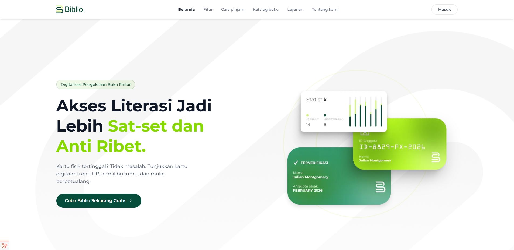
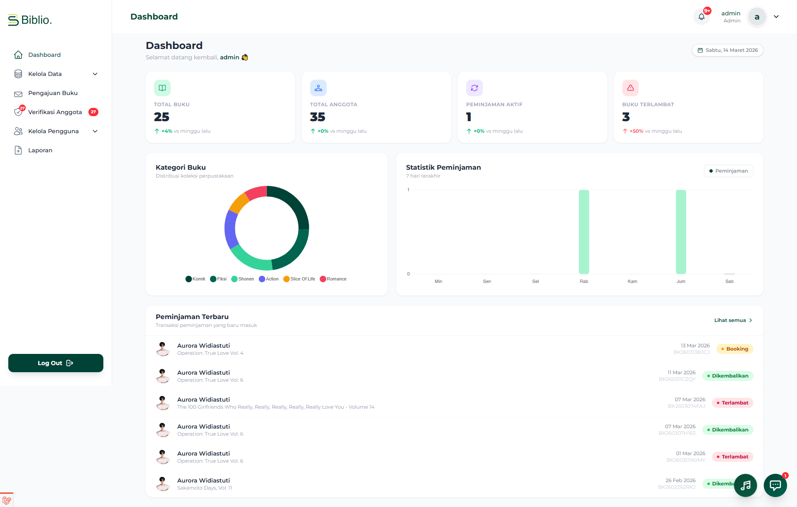
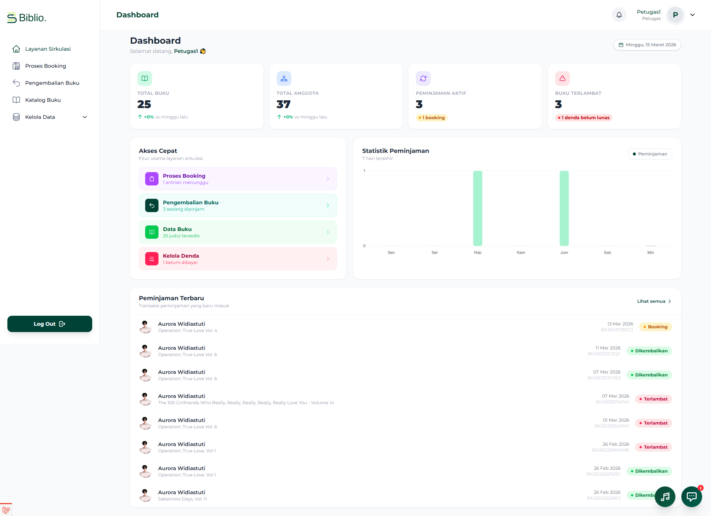
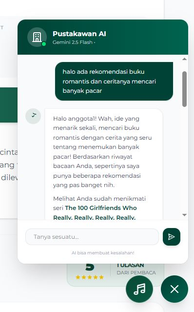
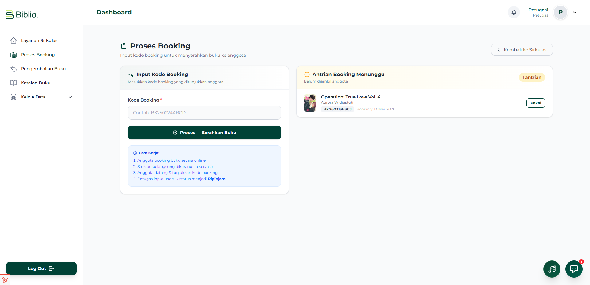
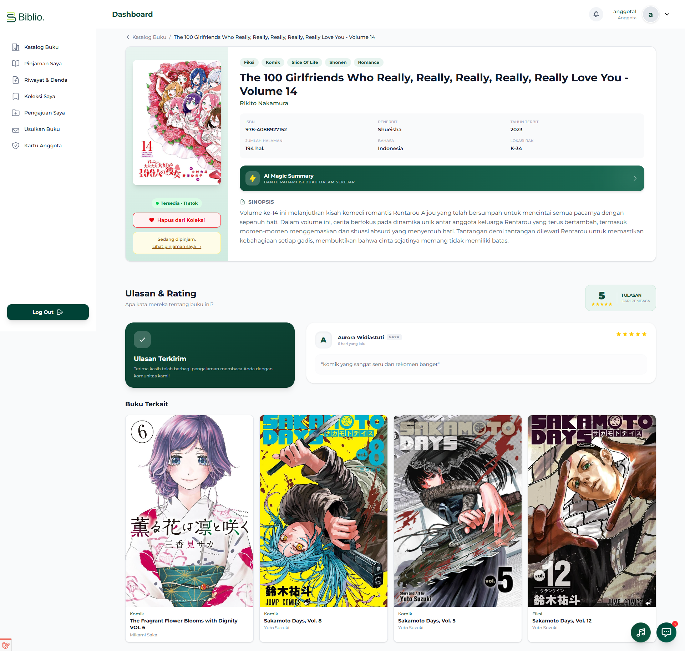
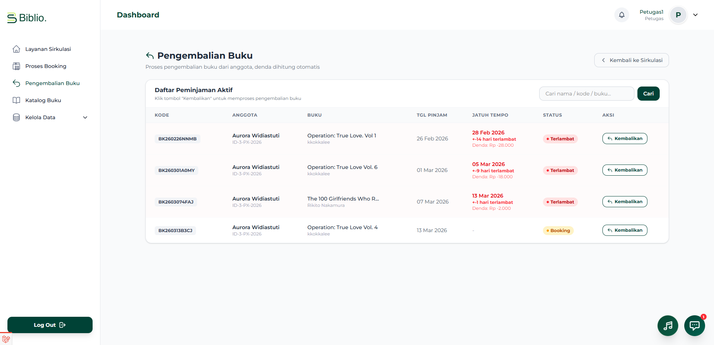

<div align="center">
  
  <br>
  <h1>📚 Sistem Perpustakaan Digital (Biblio)</h1>
  <p>Proyek aplikasi web manajemen sirkulasi perpustakaan modern dengan fitur rekomendasi berbasis AI serta antarmuka yang bersih dan interaktif.</p>
</div>

---

## 📌 Deskripsi Proyek

**Biblio** adalah sistem informasi perpustakaan berbasis web yang dikembangkan khusus untuk mempermudah pengelolaan data katalog buku, administrasi keanggotaan, hingga sirkulasi peminjaman secara efisien. Proyek ini juga disusun guna memenuhi kualifikasi **UKK (Uji Kompetensi Keahlian)** / Proyek Akhir, dengan keunggulan pada UI/UX yang modern, integrasi analitik, hingga implementasi Pustakawan AI (Chatbot).

## 🚀 Fitur Unggulan Sistem

Aplikasi ini menyajikan tiga level otorisasi/aktor dengan kapabilitas fitur sebagai berikut:

### 👨‍💼 Panel Admin (Kepala / Administrator)

- **Dashboard Statistik & Analitik**: Ringkasan total buku, keanggotaan, peminjaman berjalan, tren peminjaman berwujud _grafik/chart_ visual, serta rekap notifikasi buku terlambat.
- **Katalog Master Data**: Pengelolaan entitas inti buku secara tersentralisasi meliputi manajemen kategori buku, penerbit, pengarang, dan penempatan rak buku.
- **Verifikasi Anggota Baru**: Sistem administrasi terintegrasi untuk menyaring dan memvalidasi calon anggota yang mendaftar di perpustakaan.
- **Manajemen Akses & Pengguna**: Mengendalikan dan mendaulat berbagai peran user (_Admin_, _Petugas_, maupun _Anggota_).
- **Laporan Administrasi & Rekap Transaksi**: Meninjau laporan atau histori menyeluruh dari siklus peminjaman maupun pengembalian beserta sanksi denda.

### 👩‍💻 Panel Petugas (Pustakawan / Layanan Sirkulasi)

- **Dashboard Layanan Sirkulasi**: Akses cepat menuju modul vital pendaftaran dan pemulangan buku (peminjaman aktif, anggota terlambat mengembalikan buku, dll).
- **Proses Reservasi & Peminjaman Langsung**: Mengonfirmasi pesanan _booking_ (reservasi) buku dari anggota via aplikasi, serta menerbitkan transaksi pinjam.
- **Modul Pengembalian & Kalkulator Denda Cerdas**: Mempermudah identifikasi tanggal pengembalian dan pelacakan denda otomatis yang dikalkulasi per hari dari keterlambatan setiap buku per anggota.
- **Katalog Manajemen Data**: Hak akses parsial untuk input katalog/tambahan judul buku baru yang diperoleh perpustakaan.

### 👥 Panel Anggota (Pemustaka)

- **E-Catalog Interaktif**: Navigasi dan kolom penelusuran judul buku yang dibekali dengan interaksi dinamis layaknya e-commerce moderen, dengan filter dan penyortiran rinci.
- **Sirkulasi Pinjaman & Reservasi Mandiri**: Memfasilitasi pemustaka mem-_booking_ buku lebih dulu lalu mengambil ke perpustakaan untuk meminimalisasi buku habis dipinjam pengguna lain.
- **Monitoring Riwayat & Tagihan Pemustaka**: Membantu memonitor apa yang masih di tangan pemustaka lengkap bersama estimasi jatuh tempo dan perhitungan estimasi nilai sanksi / denda keterlambatan (jika ada).
- **Fitur Ruang Penyimpanan (Koleksi Saya)**: Kemampuan _wishlist_ atau menaruh koleksi bacaan ke dalam daftar personal yang ingin dibaca.
- **Kotak Pengajuan & Usulan Pengadaan Buku**: Formulir bagi pelanggan untuk melayangkan usulan koleksi judul baru ke operasional sekolah/perpustakaan secara online.
- **Kartu Identitas Anggota (E-Card)**: Panel kartu virtual untuk melihat atau membawa ID barcode/member saat berkunjung langsung.
- **🤖 Pustakawan AI (Chatbot Smart Assistant)**: Terintegrasi dengan NLP/AI cerdas guna menjadi pendamping bagi para pembaca – menjawab sinopsis cerita, ide bacaan buku romantis/fantasi sesuai katalog perpustakaan, hingga diskusi seputar literatur tanpa henti!

---

## 📸 Dokumentasi & Antarmuka (Preview)

Berikut adalah beberapa pratinjau antarmuka beresolusi tinggi di sistem Biblio:

### 1. Dashboard Admin

> Menyajikan data analitik operasional harian perpustakaan serta persentase rasio.
> 

### 2. Dashboard Petugas (Layanan Sirkulasi)

> Terminal navigasi sehari-hari bagi Pustakawan / Petugas Sirkulasi yang sedang bertugas.
> 

### 3. Katalog Koleksi untuk Anggota

> Eksplorasi ribuan judul yang menarik dengan balutan desain imersif untuk pembaca sejati.
> 

### 4. Pustakawan AI (Chatbot / Gemini Flash AI)

> Pustakawan virtual interaktif yang membantu Anda mengidentifikasi isi kisah tanpa perlu tersesat di tumpukan buku!
> 

### 5. Formulir Peminjaman & Pengembalian Terpadu

|                       Input Peminjaman (Petugas)                        |                          Detail Buku                          |                      Pengembalian & Perhitungan Denda                       |
| :---------------------------------------------------------------------: | :-----------------------------------------------------------: | :-------------------------------------------------------------------------: |
|  |  |  |

---

## 🛠 Teknologi Utama di Balik Sistem

Proyek ini mengadopsi stack tekonologi yang lincah dan berpusat pada optimalisasi alur pengalaman user (UX).

- **Bahasa & Backend Framework**: PHP (Laravel 11.x)
- **Frontend / Styling Toolbox**: CSS Utility-First (Tailwind CSS), Flowbite UI
- **Database Server**: Relational DB (MySQL)
- **Interaksi Frontend Lapis Pertama**: Alpine.js, Ajax
- **Kecerdasan Buatan (Integrasi Eksternal)**: Google Gemini API (AI Studio)

---

## ⚙️ Panduan Menjalankan Sistem (Setup Lokal)

Ikuti instruksi instalasi di bawah untuk menjalankan servernya di lingkungan PC Anda (localhost):

1. **Clone repository ini:**

    ```bash
    git clone <URL_REPO_ANDA>
    cd sistem-perpustakaan-digital
    ```

2. **Dapatkan Paket Dependensi Composer & Node Package Manager:**

    ```bash
    composer install
    npm install
    ```

3. **Salin & Modifikasi Environment Variable:**

    ```bash
    cp .env.example .env
    ```

4. **Konfigurasikan Data Database dalam file `.env`:**
   Sesuaikan parameter `DB_DATABASE`, username, dan kata sandi sesuai dengan MySQL di laptop (misalnya PhpMyAdmin).

    ```env
    DB_CONNECTION=mysql
    DB_HOST=127.0.0.1
    DB_PORT=3306
    DB_DATABASE=db_perpustakaan
    DB_USERNAME=root
    DB_PASSWORD=
    ```

5. **Pembuatan Key Internal Laravel:**

    ```bash
    php artisan key:generate
    ```

6. **Migrasikan Struktur Tabel Basis Data dan Isi Data Dummy:**
   _(Langkah ini otomatis men-generate data sampel, termasuk admin, petugas, tipe kategori, dll.)_

    ```bash
    php artisan migrate --seed
    ```

7. **Aktifkan Storage Link (Untuk Unggah Gambar Cover/Profil):**

    ```bash
    php artisan storage:link
    ```

8. **Proses Akhir: Menghidupkan Layanan Server Terpadu**
   Buka terminal pertama dan jalankan:
    ```bash
    php artisan serve
    ```
    Buka terminal kedua (Dibutuhkan untuk kompilasi ulang aset Tailwind):
    ```bash
    npm run dev
    ```
    _Buka http://127.0.0.1:8000 di bilah alamat browser pilihan Anda._

---

## 🔐 Basis Akun / Kredensial Demonstrasi

Apabila berhasil menginstalasi dengan langkah `--seed`, berikut sejumlah autentikasi prasetel dari simulasi:

| Roles / Hak Akses        | Username Atribut | Password Default |
| :----------------------- | :--------------- | :--------------- |
| **Admin Pusat**          | `admin`          | `password`       |
| **Petugas / Pustakawan** | `petugas`        | `password`       |
| **Anggota Trial**        | `anggota`        | `password`       |

📝 _Catatan: Sangat disarankan untuk mendefinisikan/merubah sandi atau mematikan skema seeder saat aplikasi digunakan dalam bentuk produksi (Production / Hosting)._

---

<p align="center">
  <sub>Dibangun dengan tujuan fungsionalitas murni yang menunjang aktivitas pelajar & pustakawan sehari-hari. 🚀</sub>
</p>
