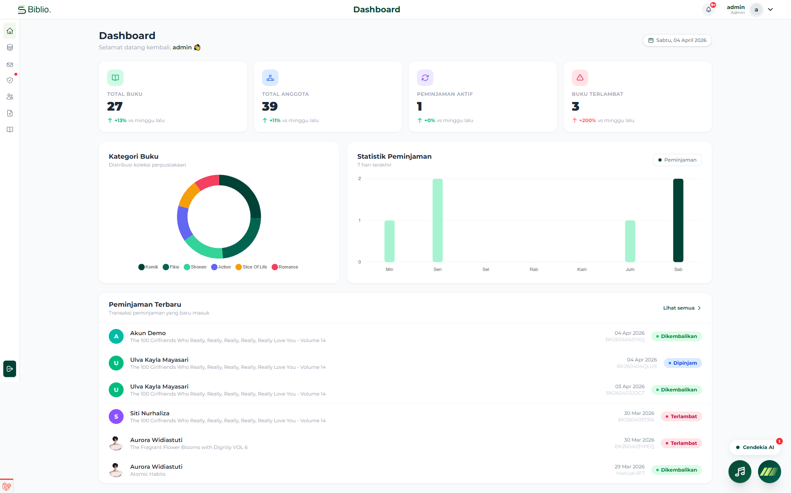
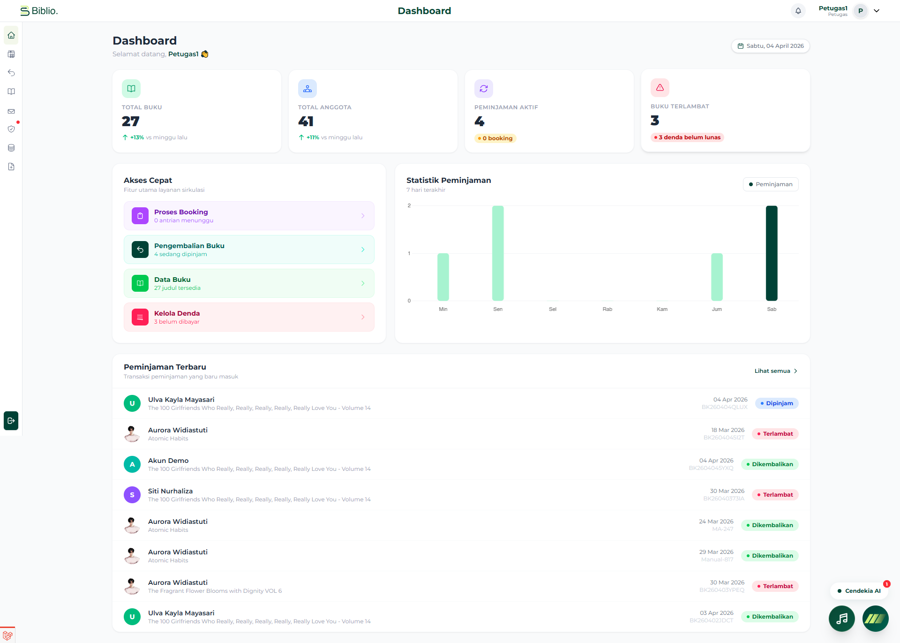
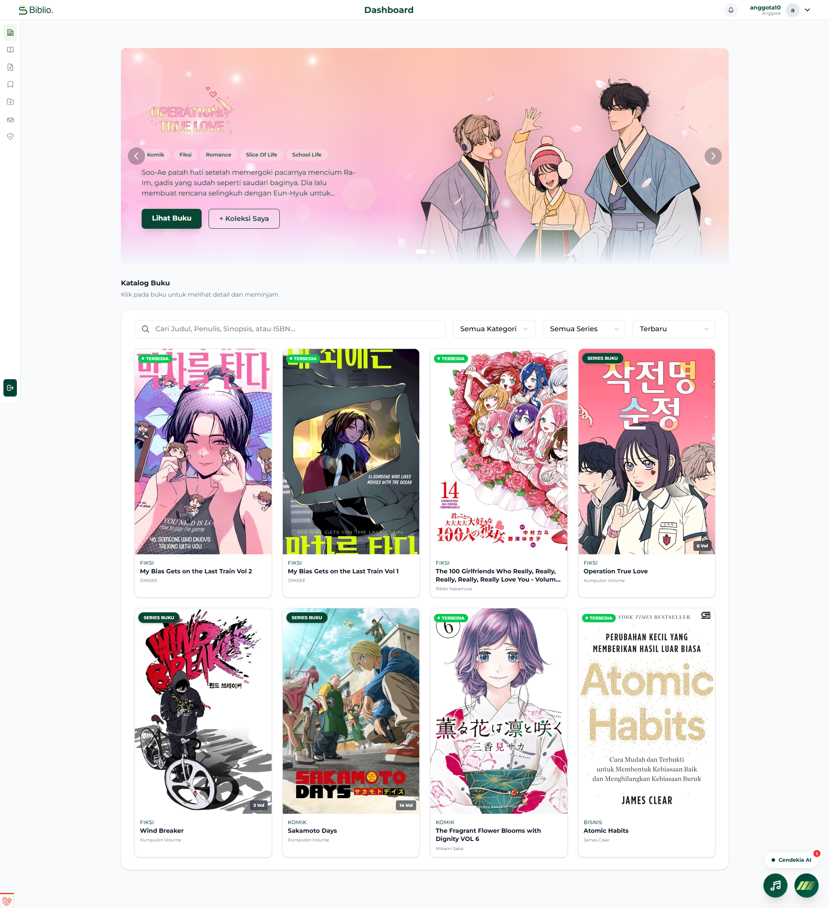
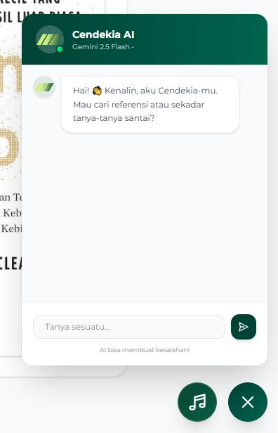
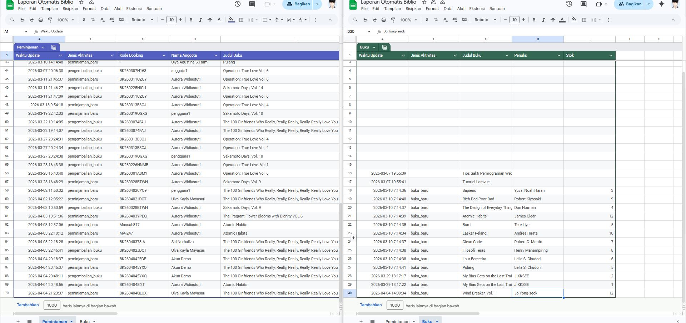

<div align="center">
  
  <br>
  <h1>Sistem Perpustakaan Digital (Biblio)</h1>
  <p>Proyek aplikasi web manajemen sirkulasi perpustakaan modern dengan fitur AI, Payment Gateway, Otomasi Webhook, serta antarmuka yang bersih dan interaktif.</p>
</div>

---

## Deskripsi Proyek

**Biblio** adalah sistem informasi perpustakaan berbasis web yang dikembangkan khusus untuk mempermudah pengelolaan data katalog buku, administrasi keanggotaan, hingga sirkulasi peminjaman secara efisien. Proyek ini juga disusun guna memenuhi kualifikasi **UKK (Uji Kompetensi Keahlian)** / Proyek Akhir, dengan keunggulan pada UI/UX yang modern, integrasi analitik AI, hingga sistem pembayaran digital terotomatisasi.

## Fitur Unggulan Sistem

Aplikasi ini menyajikan desain yang _responsive_ dengan dukungan fitur-fitur **advance / tingkat lanjut** sebagai berikut:

### Fitur Baru & Integrasi Modern

- **Integrasi Payment Gateway (Midtrans)**: Anggota dapat membayar tagihan denda secara _cashless_ langsung dari panel dashboard mereka menggunakan QRIS, Virtual Account (BCA, Mandiri, BNI, BRI), atau e-Wallet (GoPay, ShopeePay). Transaksi diverifikasi secara otomatis tanpa input manual admin!
- **Cendekia AI (Chatbot Assistant)**: Terintegrasi dengan algoritma Google Gemini API. Pustakawan virtual ini dapat merekomendasikan buku romantis, merangkum plot cerita, hingga mendiskusikan berbagai topik literatur layaknya kawan membaca sesungguhnya.
- **Otomasi Webhook via Make.com**: Usulan pengadaan koleksi judul baru (propose book) yang disubmit pemustaka akan secara riwayat dikirimkan alert / notifikasi ping ke sistem _webhook_ sehingga staf pengelola langsung terinformasi.
- **Dynamic Skeleton Screen Loader**: Transisi asinkron halus pada katalog atau tabel riwayat, memperlihatkan "kerangka" (_skeleton_) sementara _background task_ dimuat. Tidak ada lagi layar _freeze_!
- **Laporan Administrasi Premium**: Dilengkapi fitur _Export to Excel (XLSX)_ dan Cetak Instan untuk pembuatan rekap sirkulasi maupun audit denda.

### Panel Admin (Kepala / Administrator)

- **Dashboard Statistik & Analitik**: Ringkasan total buku, keanggotaan, peminjaman berjalan, tren peminjaman berwujud _grafik/chart_ visual, serta rekap notifikasi terlambat.
- **Katalog Master Data**: Pengelolaan entitas inti buku secara tersentralisasi meliputi manajemen kategori buku, penerbit, pengarang, dan penempatan rak buku.
- **Laporan & Audit Ekspor Lengkap**: Meninjau laporan atau histori menyeluruh dari siklus transaksi dan meng-_export_-nya untuk kebutuhan internal perpustakaan.

### Panel Petugas (Pustakawan / Layanan Sirkulasi)

- **Dashboard Layanan Sirkulasi**: Akses cepat menuju modul vital pendaftaran dan pemulangan buku (terlambat, lunas, dll).
- **Proses Reservasi & Peminjaman Langsung**: Mengonfirmasi pesanan _booking_ buku dari anggota via aplikasi, serta menerbitkan transaksi pinjam.
- **Perhitungan Denda Otomatis**: Mempermudah identifikasi tanggal pengembalian dan pelacakan denda yang dikalkulasi per hari secara _real-time_.

### Panel Anggota (Pemustaka)

- **Sirkulasi Pinjaman & Reservasi Mandiri**: Memfasilitasi pemustaka mem-_booking_ buku lebih dulu agar tidak kehabisan stok pinjaman.
- **Gateway Tagihan Pemustaka**: Memonitor apa yang masih di tangan pemustaka lengkap dengan estimasi jatuh tempo dan bayar tunai (via Snap Midtrans) jika denda berlaku.
- **Koleksi Saya & E-Card**: Fitur _wishlist_ terintegrasi, dan Kartu Identitas Anggota virtual berupa barcode ID instan.

---

## Dokumentasi & Antarmuka (Preview)

Berikut adalah beberapa pratinjau antarmuka beresolusi tinggi di sistem Biblio:

### 1. Dashboard Admin

> Menyajikan data analitik operasional harian perpustakaan serta persentase rasio.
> 

### 2. Dashboard Petugas (Layanan Sirkulasi)

> Terminal utama sehari-hari bagi Pustakawan yang bertugas mengelola peminjaman.
> 

### 3. Katalog Koleksi untuk Anggota & Skeleton Loader

> Eksplorasi ribuan judul menarik menggunakan load balancing asinkron modern.
> 

### 4. Pustakawan AI (Cendekia Chatbot / Gemini API)

> Pustakawan virtual yang membantu mengidentifikasi kisah tanpa tersesat di tumpukan buku!
> 

### 5. Integrasi Midtrans & Checkout Denda (Baru!)

> Pembayaran denda otomatis tanpa intervensi admin.

|                    Pilih Metode Pembayaran (Snap Midtrans)                    |                      Konfirmasi Pembayaran Berhasil                       |
| :---------------------------------------------------------------------------: | :-----------------------------------------------------------------------: |
|  |  |

### 6. Auto Report Generation & Spreadsheet Export

> Fitur pencetakan rekap dan formulasi auto-report berkala via Spreadsheet (XLSX).
> 
> <br><br>
> 

---

## Teknologi Utama di Balik Sistem

Proyek ini mengadopsi stack tekonologi yang lincah dan berpusat pada optimalisasi alur pengalaman user:

- **Bahasa & Backend Framework**: PHP (Laravel 12.x)
- **Frontend / Styling Toolbox**: CSS Utility-First (Tailwind CSS v3+), Flowbite UI
- **Database Server**: Relational DB (MySQL)
- **State & Interactivity**: Alpine.js, Ajax
- **Gateway & API Eksternal**:
    - Midtrans Snap API (Digital Payment)
    - Google Gemini API (AI Studio)
    - Make.com (Webhook Automation)

---

## Panduan Menjalankan Sistem (Setup Lokal)

Ikuti instruksi instalasi di bawah untuk menjalankan servernya di lingkungan PC Anda (localhost):

1. **Clone repository ini:**

    ```bash
    git clone <URL_REPO_ANDA>
    cd sistem-perpustakaan-digital
    ```

2. **Dapatkan Paket Dependensi Composer & Node Package Manager:**

    ```bash
    composer install
    npm install
    ```

3. **Salin & Modifikasi Environment Variable:**

    ```bash
    cp .env.example .env
    ```

4. **Konfigurasikan Data Database & Gateway dalam file `.env`:**
   Sesuaikan parameter `DB_DATABASE`, API Key Gemini, dan API Midtrans Anda.

    ```env
    DB_CONNECTION=mysql
    DB_HOST=127.0.0.1
    DB_PORT=3306
    DB_DATABASE=db_perpustakaan
    DB_USERNAME=root
    DB_PASSWORD=

    # Konfigurasi AI & Webhook
    GEMINI_API_KEY=AIzA_xxxxxxxxxxxxxx
    MAKE_WEBHOOK_URL=https://hook.eu1.make.com/xxxxxxxxx

    # Midtrans Config
    MIDTRANS_SERVER_KEY=SB-Mid-server-xxxxxxxxx
    MIDTRANS_CLIENT_KEY=SB-Mid-client-xxxxxxxxx
    MIDTRANS_IS_PRODUCTION=false
    ```

5. **Pembuatan Key Internal Laravel:**

    ```bash
    php artisan key:generate
    ```

6. **Migrasikan Struktur Tabel Basis Data dan Isi Data Dummy:**
   _(Langkah ini otomatis men-generate data sampel, termasuk admin, petugas, tipe kategori, dll.)_

    ```bash
    php artisan migrate --seed
    ```

7. **Aktifkan Storage Link (Untuk Unggah Gambar Cover/Profil):**

    ```bash
    php artisan storage:link
    ```

8. **Proses Akhir: Menghidupkan Layanan Server Terpadu**
   Buka terminal pertama dan jalankan:
    ```bash
    php artisan serve
    ```
    Buka terminal kedua (Dibutuhkan untuk kompilasi ulang aset Tailwind):
    ```bash
    npm run dev
    ```
    _Buka http://127.0.0.1:8000 di bilah alamat browser pilihan Anda._

---

## Basis Akun / Kredensial Demonstrasi

Apabila berhasil menginstalasi dengan langkah `--seed`, berikut sejumlah autentikasi prasetel dari simulasi:

| Roles / Hak Akses        | Username Atribut | Password Default |
| :----------------------- | :--------------- | :--------------- |
| **Admin Pusat**          | `admin`          | `password`       |
| **Petugas / Pustakawan** | `petugas`        | `password`       |
| **Anggota Trial**        | `anggota`        | `password`       |

_Catatan: Sangat disarankan untuk mendefinisikan/merubah sandi atau mematikan skema seeder saat aplikasi digunakan dalam bentuk produksi (Production / Hosting). Pastikan juga mode Midtrans diubah ke produksi._

---

<p align="center">
  <sub>Dibangun dengan tujuan fungsionalitas, integrasi digital terkini, dan UX/UI yang menunjang aktivitas sivitas perpustakaan sehari-hari.</sub>
</p>
