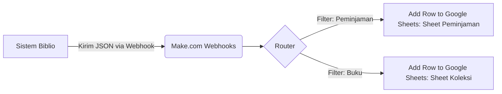

# Auto-Sync Reporting (Integrasi Google Sheets via Make.com)

Fitur **Auto-Sync Reporting** adalah integrasi otomatis antara Sistem Perpustakaan Digital Biblio dengan **Google Sheets** menggunakan platform otomatisasi **Make.com** (dahulu Integromat). Fitur ini memungkinkan data transaksi dan koleksi tersinkronisasi secara real-time ke spreadsheet tanpa perlu export manual.

## 1. Alur Kerja (Workflow Make.com)

Sistem menggunakan arsitektur berbasis **Webhook** yang dikirim dari aplikasi Biblio ke skenario di Make.com. Berikut adalah representasi alur kerjanya:



### Komponen Skenario di Make.com:
1.  **Custom Webhook**: Bertindak sebagai pintu masuk (entry point) data dari aplikasi.
2.  **Router**: Memisahkan alur logika data berdasarkan tipe data yang dikirim (apakah itu data transaksi peminjaman atau data buku baru).
3.  **Filters**: 
    - `Filter Peminjaman`: Memastikan data hanya diteruskan jika berisi payload transaksi.
    - `Filter Buku`: Memastikan data hanya diteruskan jika berisi payload informasi buku.
4.  **Google Sheets (Add a Row)**: Modul akhir yang menulis data secara otomatis ke baris baru pada spreadsheet yang telah ditentukan.

---

## 2. Cara Kerja Integrasi

### Trigger dari Laravel (Aplikasi Biblio)
Setiap kali terjadi aksi penting (seperti peminjaman baru dikonfirmasi atau buku baru ditambahkan), aplikasi akan mengirimkan permintaan HTTP POST (Webhook) ke URL yang diberikan oleh Make.com.

```php
// Contoh Trigger Webhook di Controller
public function syncToMake($data, $type)
{
    Http::post(config('services.make_webhook_url'), [
        'type' => $type,
        'data' => $data,
        'timestamp' => now()->toDateTimeString()
    ]);
}
```

---

## 3. Konfigurasi Sistem

### Langkah 1: Setup di Make.com
1.  Buat skenario baru di [Make.com](https://www.make.com).
2.  Tambahkan modul **Webhooks** -> **Custom Webhook**.
3.  Salin URL Webhook yang muncul (contoh: `https://hook.us1.make.com/xxxxxx`).
4.  Gunakan **Router** untuk membagi jalur ke dua modul **Google Sheets**.
5.  Atur **Filter** pada masing-masing jalur (misalnya: `type Equal to 'peminjaman'`).

### Langkah 2: Konfigurasi di Aplikasi (.env)
Pastikan URL Webhook dari Make.com sudah dimasukkan ke dalam file `.env` aplikasi Biblio:

```dotenv
MAKE_WEBHOOK_URL=https://hook.us1.make.com/xxxxxx
```

---

## 4. Keuntungan Menggunakan Make.com

-   **Tanpa Coding API Yang Rumit**: Tidak perlu mengelola library Google SDK yang berat di dalam server.
-   **Visualisasi Alur**: Admin dapat melihat secara visual log data yang masuk dan di mana terjadi kegagalan (jika ada).
-   **Fleksibilitas**: Jika ingin menambah integrasi lain (misal: kirim notifikasi Telegram saat denda lunas), cukup tambah modul baru di Make.com tanpa mengubah kode di aplikasi utama.

---

## 5. Troubleshooting Sync

| Gejala | Penyebab Umum | Solusi |
|---|---|---|
| Data tidak masuk ke Sheets | Webhook di Make.com belum status "Scheduling: ON" | Pastikan skenario sudah diaktifkan (ON) di dashboard Make.com. |
| Data masuk ke jalur yang salah | Pengaturan filter pada Router kurang tepat | Cek field `type` yang dikirim dari aplikasi dan sesuaikan dengan filter di Router. |
| Error 404/500 saat kirim data | URL Webhook di `.env` salah atau expired | Ganti URL Webhook di `.env` dengan URL terbaru dari Make.com. |
