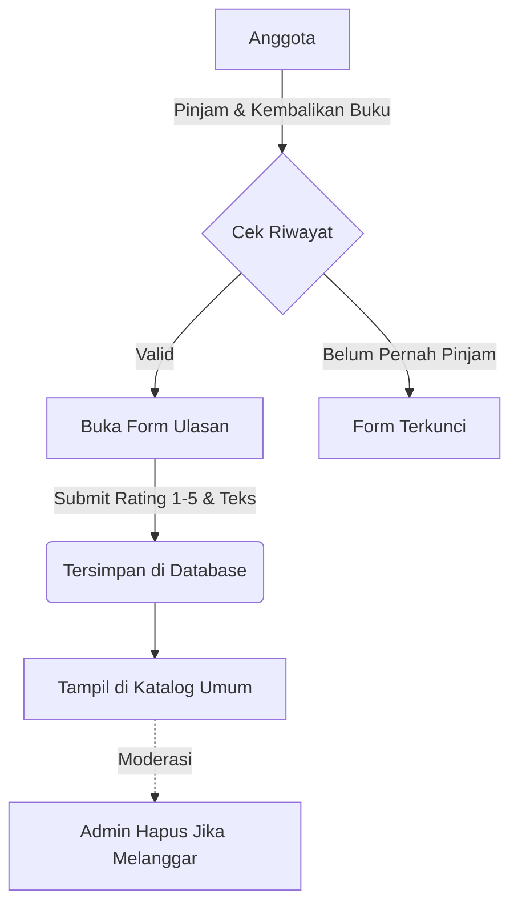

# Logika Fitur Koleksi (Wishlist) & Ulasan Buku

Sistem Perpustakaan Digital Biblio menyediakan fitur interaktif bagi anggota berupa penyimpanan buku ke "Koleksi Saya" (Wishlist) serta sistem pemberian Ulasan (Review) dan Rating. Dokumen ini menjelaskan logika di balik kedua fitur tersebut.

## 1. Logika Koleksi Saya (Wishlist)

Fitur Koleksi Saya memungkinkan anggota untuk menyimpan buku-buku yang menarik perhatian mereka agar mudah ditemukan di lain waktu tanpa harus meminjamnya saat itu juga.

### Alur Kerja:
1. **Penyimpanan:** Di halaman detail buku atau katalog, anggota menekan ikon "Simpan ke Koleksi" (biasanya berupa ikon pita/bookmark).
2. **Validasi:** Sistem mengecek tabel `koleksi_pribadi` menggunakan kombinasi `id_user` dan `id_buku`.
   - Jika belum ada, sistem membuat record baru.
   - Jika sudah ada, sistem menghapusnya (toggle behavior/lepas dari koleksi).
3. **Akses:** Anggota dapat melihat daftar buku tersimpan ini di menu **Koleksi Saya** pada dashboard anggota.

> **Catatan:** Memasukkan buku ke Koleksi Saya **tidak mengurangi stok fisik buku** dan bukan merupakan proses pemesanan (booking).

---

## 2. Sistem Ulasan dan Rating (Review)

Untuk memberikan rekomendasi yang objektif kepada anggota lain, sistem memfasilitasi fitur ulasan untuk setiap buku.

### Aturan & Syarat Pemberian Ulasan:
Sistem memberlakukan pembatasan ketat untuk mencegah ulasan spam:
- **Harus Pernah Meminjam:** Seorang anggota **hanya dapat memberikan ulasan** pada buku yang status peminjamannya sudah `dikembalikan`. Sistem akan menolak form ulasan jika riwayat peminjaman buku tersebut tidak ditemukan pada akun anggota yang bersangkutan.
- **Satu Ulasan per Buku:** Setiap anggota hanya boleh memberikan maksimal 1 ulasan untuk 1 judul buku. Jika anggota pernah meminjam buku yang sama berulang kali, mereka tetap hanya bisa memberikan ulasan satu kali, atau mengedit ulasan yang sudah ada.

### Komponen Ulasan:
- **Rating:** Skala 1 hingga 5 bintang.
- **Ulasan Teks:** Komentar tertulis mengenai pengalaman membaca buku tersebut.

### Perhitungan Rating Rata-rata:
Nilai rating yang tampil di katalog buku (misal: 4.5 Bintang) adalah hasil kalkulasi agregat (AVG) dari seluruh rating yang disetujui untuk buku tersebut.

```php
// Contoh Pseudocode Perhitungan
$rataRataRating = Ulasan::where('id_buku', $buku->id)->avg('rating');
```

## 3. Moderasi Ulasan oleh Admin

Secara default, ulasan langsung tayang di halaman publik. Namun, Admin dan Petugas memiliki hak moderasi:
- Admin dapat melihat semua ulasan melalui menu **Laporan / Ulasan**.
- Admin berhak **menghapus** ulasan yang mengandung unsur SARA, spam, atau kata-kata tidak pantas. (Fitur edit ulasan milik orang lain tidak diberikan untuk menjaga orisinalitas).


