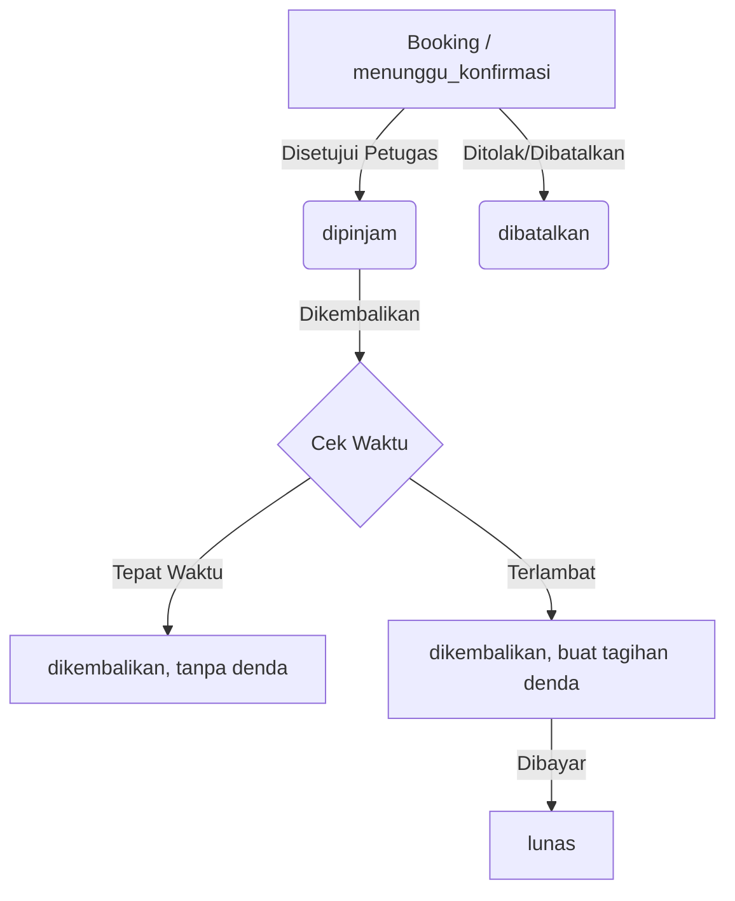

# Logika Peminjaman & Pengembalian Buku

Dokumen ini menjelaskan secara detil bagaimana alur logika transaksi utama dalam Sistem Perpustakaan Digital Biblio, yaitu peminjaman (booking) hingga pengembalian buku.

## 1. Alur Peminjaman (Booking oleh Anggota)

Sistem menggunakan model **Booking Mandiri** di mana anggota yang ingin meminjam buku harus mengajukan permintaan peminjaman terlebih dahulu melalui panel mereka.

### Syarat Peminjaman:
- Anggota memiliki akun yang aktif (tidak diblokir/nonaktif).
- Anggota **tidak memiliki denda** yang belum dibayar (status denda harus lunas semua). Jika ada denda aktif, tombol "Pinjam Buku" akan disembunyikan atau dinonaktifkan.
- Stok buku yang ingin dipinjam tersedia (> 0) di inventaris perpustakaan (dihitung dari total masuk dikurangi yang sedang dipinjam).
- Anggota tidak melewati batas maksimal peminjaman aktif secara bersamaan (misal dibatasi 3 buku, opsional berdasarkan pengaturan `config.app`).

### Logika Saat Booking:
1. Anggota menekan tombol **Pinjam** dari detail buku.
2. Status Peminjaman di-set menjadi `menunggu_konfirmasi`.
3. Tanggal peminjaman dan jatuh tempo **belum** di-set.
4. Stok fisik buku **belum** dikurangi secara permanen, namun tercatat sebagai bagian dari antrean.

---

## 2. Alur Konfirmasi Peminjaman (Oleh Petugas/Admin)

Permintaan peminjaman dari anggota akan masuk ke panel Petugas (di menu **Menunggu Konfirmasi**).

### Logika Saat Konfirmasi:
Ketika petugas menekan tombol **Setujui / Serahkan Buku**:
1. Petugas memastikan anggota telah memberikan kode validasi atau memperlihatkan bukti booking.
2. Sistem mengubah status peminjaman menjadi `dipinjam`.
3. Atribut `tgl_pinjam` diisi dengan tanggal hari itu (`Carbon::today()`).
4. Atribut `tgl_jatuh_tempo` dihitung dengan menambahkan hari peminjaman default, biasanya **7 hari** ke depan (`Carbon::today()->addDays(7)`).
5. Stok buku fisik (`stok` di master buku) **dkurangi 1**.

> **Note:** Petugas juga bisa menolak peminjaman jika fisik buku rusak atau anggota tidak mengambil buku dalam kurun waktu tertentu (misal 2x24 jam). Jika ditolak, status menjadi `dibatalkan` dan anggota tidak dikenakan sanksi apapun.

---

## 3. Alur Pengembalian Buku

Siklus akhir dari transaksi adalah anggota mengembalikan buku ke perpustakaan untuk dikonfirmasi oleh Petugas.

### Logika Saat Pengembalian:
Ketika buku fisik diserahkan, petugas akan memproses pengembalian melalui sistem:
1. Petugas menekan tombol **Kembalikan**.
2. Sistem mengubah status peminjaman menjadi `dikembalikan`.
3. Atribut `tgl_kembali` dicatat sesuai hari pengembalian tersebut.
4. Stok buku fisik (`stok` pada master buku) **ditambah 1**.

### Pengecekan Keterlambatan:
Pada saat proses "Kembalikan", sistem secara otomatis melakukan pengecekan `tgl_kembali` melawan `tgl_jatuh_tempo` untuk **menghitung denda secara otomatis** (lihat dokumentasi [*Logika Pembayaran & Denda*](logika-pembayaran-denda)).

## Diagram Sederhana Status

## Pembatalan Peminjaman
Anggota dapat membatalkan peminjaman mereka sendiri **hanya** jika status masih `menunggu_konfirmasi`. Jika status sudah `dipinjam`, pembatalan diblokir, dan alurnya harus melewati proses Pengembalian buku di meja petugas.
